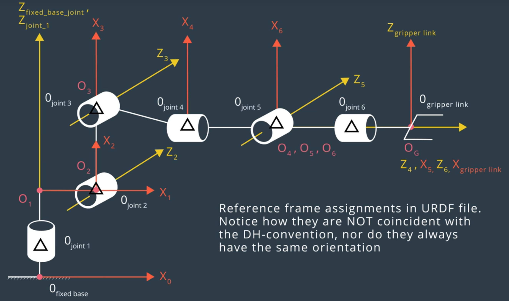
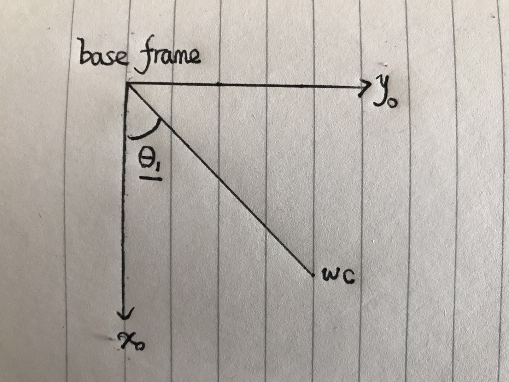
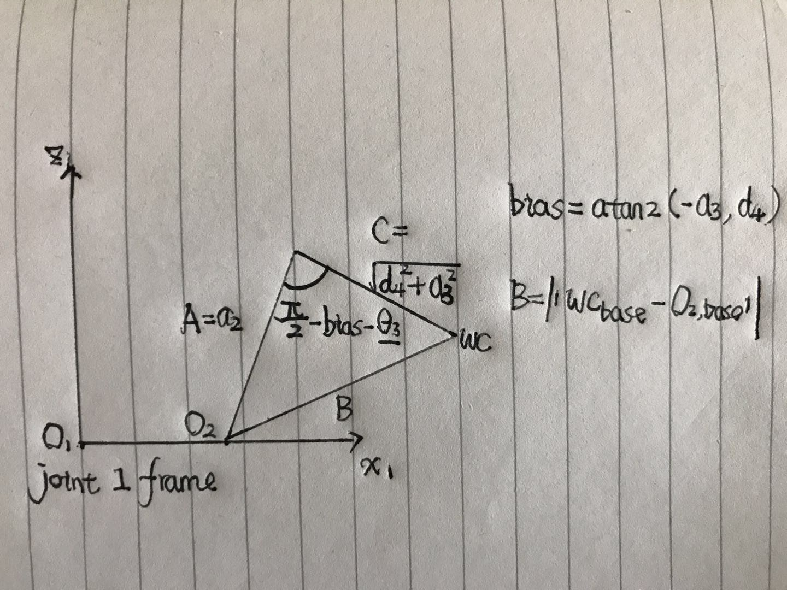

# Kinematics: Pick & Place


---

### Kinematic Analysis
#### 1. Run the forward_kinematics demo and evaluate the kr210.urdf.xacro file to perform kinematic analysis of Kuka KR210 robot and derive its DH parameters.

The frames used for **DH parameter derivation** is shown in figure below:


The frames used for **URDF specification** is shown as follows:



Define symbol as follows:

1. **jo1_z** means **origin of joint1, z component** and **jo2_z** means **origin of joint2, z component**
2. **jo2_x** means **origin of joint2, x component**
3. **jo3_z** means **origin of joint3, z component**
4. **jo4_z** means **origin of joint4, z component**
5. **jo4_x** means **origin of joint4, x component** and **jo5_x** means **origin of joint5, x component**
6. **jo6_x** means **origin of joint6, x component** and **jog_x** means **origin of joint gripper, x component**

The correspondence between **DH parameter** and **URDF specification** can be established as follows:

1. d1: jo1_z + jo2_z =  0.33 +  0.42 = 0.75;
2. a1:         jo2_x =  0.35;
3. a2:         jo3_z =  1.25;
4. a3:         jo4_z = -0.054;
5. d4: jo4_x + jo5_x =  0.96 +  0.54 = 1.50;
6. d7: jo6_x + jog_x = 0.193 +  0.11 = 0.303

And the final DH parameter table is as follows

| Link(i) | alpha(i-1) | a(i-1) |  d(i)  |   theta(i)   |
|:-------:|:----------:|:------:|:------:|:------------:|
|    1    |      0     |    0   |  +0.75 |    theta1    |
|    2    |    -pi/2   | +0.350 |    0   | -pi/2+theta2 |
|    3    |      0     | +1.250 |    0   |    theta3    |
|    4    |    -pi/2   | -0.054 |  +1.50 |    theta4    |
|    5    |    +pi/2   |    0   |    0   |    theta5    |
|    6    |    -pi/2   |    0   |    0   |    theta6    |
|    7    |      0     |    0   | +0.303 |       0      |

#### 2. Using the DH parameter table you derived earlier, create individual transformation matrices about each joint. In addition, also generate a generalized homogeneous transform between base_link and gripper_link using only end-effector(gripper) pose.

Using the utility function defined in <a href="kuka_arm/scripts/IK_server.py">IK_Server.py</a>, the transformation matrices can be described as follows:

```python
  # DH parameter matrices:
  T_01 = simplify(
      denavit_hartenburg_matrix(alpha0, a0, theta1, d1).subs(config)
  )
  T_12 = simplify(
      denavit_hartenburg_matrix(alpha1, a1, theta2, d2).subs(config)
  )
  T_23 = simplify(
      denavit_hartenburg_matrix(alpha2, a2, theta3, d3).subs(config)
  )
  T_34 = simplify(
      denavit_hartenburg_matrix(alpha3, a3, theta4, d4).subs(config)
  )
  T_45 = simplify(
      denavit_hartenburg_matrix(alpha4, a4, theta5, d5).subs(config)
  )
  T_56 = simplify(
      denavit_hartenburg_matrix(alpha5, a5, theta6, d6).subs(config)
  )
  T_67 = simplify(
      denavit_hartenburg_matrix(alpha6, a6, theta7, d7).subs(config)
  )
  # Transformation from DH gripper frame to actual gripper frame
  T_7G = simplify(
      rotation_z_matrix(pi)*rotation_y_matrix(-pi/2)
  )
```

In the above frame, the first seven matrices are individual transformation matrices specified by DH parameters.
The last matrix is the transformation between DH gripper frame and actual gripper frame used by ROS.

The homogeneous transformation from gripper_link to base_link using end-effector pose is as follows:

```python
  T = R.col_join(p)
  T = T.row_join(Matrix(1,4,[0,0,0,1]))
```

In the above snippet:

1. **R** is the end-effector's orientation in rotation matrix format.
2. **p** is the end-effector's position.

#### 3. Decouple Inverse Kinematics problem into Inverse Position Kinematics and inverse Orientation Kinematics; doing so derive the equations to calculate all individual joint angles.

To decouple the problem, first set the wrist center at the origin of frame 6.

The wrist center in **end-effector frame** is:

```python
  T_6G = simplify(
    T_67 * T_7G
  )

  p_6G = T_6G[0:3,3]
  R_6G = T_6G[0:3,0:3]
  t = simplify(
      (R_6G.T)*p_6G
  )
```

Using the end-effector's pose, the wrist center in **base frame** is:

```python
  p = simplify(
      Matrix(
          [[px, py, pz]]
      ).T
  )
  R = simplify(
      rotation_rpy_matrix(
          roll,
          pitch,
          yaw
      )
  )

  wc = simplify(
      p - R*t
  )
```

Since wrist center is only affected by theta1, theta2 and theta3, after deriving it the IK problem has been successfully decoupled.

To solve **theta1** project wrist center down to x0-y0 plane as follows:



And theta1 can be easily determined as follows:

```python
  theta1 = atan2(
    wc[1,0],
    wc[0,0]
  ).evalf()
```

To solve **theta2** project wrist center to x1-z1 plane as follows:



Notice the norm of difference between wrist center and origin of joint 1, both in base frame, is determined uniquely by theta3 through **cosine law**.

And theta3 can be solved as follows:
```python
  A = simplify(
    a2.subs(config)
  )
  C = simplify(
    (sqrt(a3**2 + d4**2)).subs(config)
  )
  bias = simplify(
    atan2(-a3, d4).subs(config)
  ).evalf()

  o = simplify(
    T_02[0:3,3].subs(
      {
        theta2: 0
      }
    )
  )
  B_squared = (((wc-o).T)*(wc-o))[0,0]
  beta = acos(
      (A**2 + C**2 - B_squared)/(2*A*C)
  )
  theta3 = (
      pi/2 - beta - bias
  ).evalf()
```

Finally comes the solution for **theta2**. This is the hardest one and matrix algebra is needed as follows:

First project wrist center again to x1-z1 plane.


Use the two length constraints along x1 & z1, the following equations can be set up:


Here is the code description:

```python
  c3 = cos(theta3 + bias)
  s3 = sin(theta3 + bias)
  ma = A - C*s3
  mc = C*c3
  MA = Matrix(
      [
          [ma, -mc],
          [mc,  ma]
      ]
  )
  Mb = Matrix(
      [
          [
              wc[2,0]-d1,
              sqrt(wc[0,0]**2 + wc[1,0]**2)-a1
          ]
      ]
  ).T.subs(config)
  Mx = MA.inv("LU")*Mb
  theta2 = atan2(Mx[1,0], Mx[0,0])
```

The orientation part is easier. The key is to analyze **R_36**.

Numerically, R_36 could be determined as follows:

```python
  R_36 = (R_03.T)*R*(R_6G.T)
```

The corresponding symbolic representation is:

```python
  R_36 = Matrix(
    [
      [             DO_NOT_CARE,              DO_NOT_CARE, -sin(theta5)*cos(theta4)],
      [ sin(theta5)*cos(theta6), -sin(theta5)*sin(theta6),              cos(theta5)],
      [             DO_NOT_CARE,              DO_NOT_CARE,  sin(theta4)*sin(theta5)]
    ]
  )
```

Following the video tutorial, the last three orientation angles can be determined as follows:
```python
  theta4 = atan2(
    R_36[2,2],
    -R_36[0,2]
  )
  theta5 = atan2(
    sqrt(R_36[0,2]**2 + R_36[2,2]**2),
    R_36[1,2]
  )
  theta6 = atan2(
    -R_36[1,1],
    R_36[1,0]
  )
```
---

### Project Implementation

#### 1. Fill in the `IK_server.py` file with properly commented python code for calculating Inverse Kinematics based on previously performed Kinematic Analysis. Your code must guide the robot to successfully complete 8/10 pick and place cycles. Briefly discuss the code you implemented and your results.

I implemented the IK server as a python class as follows:

```python
class IKServer():
  def __init__(self):
    #
    # Set up ROS node
    #

    #
    # Set up sympy computing engine for FK & IK
    #

    #
    # Declare service and listen
    #

  def _solve_wc(self):
    """ Solve wrist center
    """

  def _solve_position(self):
    """ Solve theta1, theta2 & theta3
    """
  def _solve_orientation(self):
    """ Solve theta4, theta5 & theta6
    """

  def solve(self):
    """ Solve IK problem
    """

  def _handle_calculate_IK(self):
    """ Serve incoming request using self.solve
    """
```

Following the method depicted in the above section, the solver attained **0.00000** error on the 3 provided end-effector test cases.

Currently, the IK solution is still slow and **each cycle should be driven using Next button in rviz**.

BTW, please wait for the IK server to set up its sympy computing engine until you see the prompt like below:

```shell
  [IK Server]: Ready for request -- 1105.354
```

Then, click Next in rviz to enjoy each cycle!
